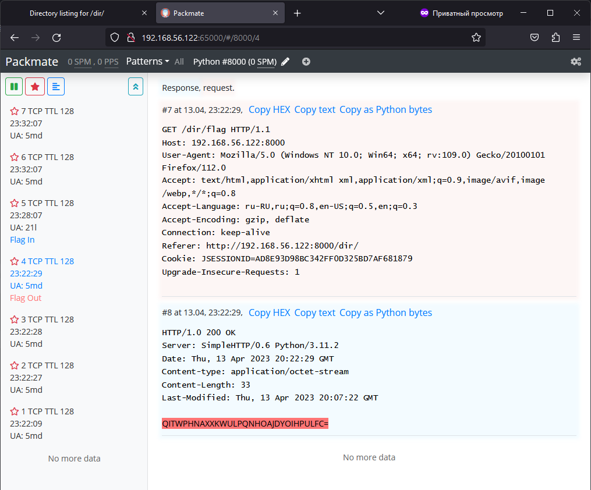

<div align="center">

# Packmate
</div>

### [EN | [RU](README.md)]
Advanced network traffic flow analyzer for A/D CTFs.

#### Features:
* Can monitor live traffic or analyze pcap files
* Supports binary and textual services
* Can highlight found patterns in packets
  * Substring
  * Regular expression
  * Binary substring
* Can automatically delete streams with content that you don't need
* Can make certain streams favorite and show only favorite streams
* Supports several simultaneous services, can show streams for a specific service or pattern
* Allows navigating streams using shortcuts
* Has the option to copy packet content in various formats
* Can concatenate adjacent packets
* Can urldecode text automatically
* Can automatically decompress GZIPed HTTP
* Can automatically deflate WebSockets with permessages-deflate extension
* Can automatically decrypt TLS with RSA using given private key (like Wireshark)


## Cloning
As this repository contains frontend part as a git submodule, it has to be cloned like this:
```bash
git clone --recurse-submodules https://gitlab.com/packmate/Packmate.git

# Or if you have older git
git clone --recursive https://gitlab.com/packmate/Packmate.git
```

If the repository was already cloned without submodule, just run:
```bash
git pull
git submodule update --init --recursive
```

## Preparation
This program uses Docker and docker-compose.

`packmate-db` will listen to port 65001 at localhost.  
Database files are saved in ./data, so in order to reset database you'll have to delete that directory.

### Settings
This program retrieves settings from environment variables, 
so it would be convenient to create an env file;  
It must be called `.env` and located at the root of the project.

Contents of the file:
```bash
# Local IP on network interface or in pcap file to tell incoming packets from outgoing
PACKMATE_LOCAL_IP=192.168.1.124
# Username for the web interface
PACKMATE_WEB_LOGIN=SomeUser
# Password for the web interface
PACKMATE_WEB_PASSWORD=SomeSecurePassword
```

If we are capturing live traffic (best option if possible):
```bash
# Mode: capturing
PACKMATE_MODE=LIVE
# Interface to capture on
PACKMATE_INTERFACE=wlan0
```
If we are analyzing pcap dump:
```bash
# Mode: dump analyzing
PACKMATE_MODE=FILE
# Path to pcap file from project root
PACKMATE_PCAP_FILE=dump.pcap
```

When capturing live traffic it's better to turn on old streams removal. Otherwise, after some time Packmate 
will start working slower.
```dotenv
PACKMATE_OLD_STREAMS_CLEANUP_ENABLED=true
# Old streams removal interval (in minutes).
# It's better to use small numbers so the streams are removed in small chunks and don't overload the server.
PACKMATE_OLD_STREAMS_CLEANUP_INTERVAL=1
# How old the stream must be to be removed (in minutes before current time)
PACKMATE_OLD_STREAMS_CLEANUP_THRESHOLD=240
```

To decrypt TLS, put the private key used to generate a certificate into the `rsa_keys` folder.

### Launch
After filling in env file you can launch the app:
```bash
sudo docker-compose up --build -d
```

If everything went fine, Packmate will be available on port `65000` from any host

### Accessing the web interface
When you open a web interface for the first time, you will be asked for a login and password
you specified in the env file.  
After entering the credentials, open the settings by clicking the cogs 
in the top right corner and modify additional parameters.


All settings are saved in the local storage and will be 
lost only upon changing server IP or port.

## Usage
First of all, you should create game services.  
To do that, click `+` in the navbar, 
then fill in the service name, port, and optimizations to perform on streams.

For a simple monitoring of flags, there is a system of patterns.  
To create a pattern, open `Patterns` dropdown menu, press `+`, then 
specify the type of pattern, the pattern itself, highlight color and other things.  
If you choose IGNORE as the type of a pattern, all matching streams will be automatically deleted.
This can be useful to filter out exploits you have already patched against.

In LIVE mode the system will automatically capture streams and show them in a sidebar.
In FILE mode you'll have to press appropriate button in a sidebar to start processing a file. 
Note that you should only do that after all services are created.  
Click at a stream to view a list of packets;
you can click a button in the sidebar to switch between binary and text views.

### Shortcuts
To quickly navigate streams you can use the following shortcuts:
* `Ctrl+Up` -- go to the next stream
* `Ctrl+Down` -- go to the previous stream
* `Ctrl+Home` -- go to the latest stream
* `Ctrl+End` -- go to the first stream

<div align="right">

*desu~*
</div>
